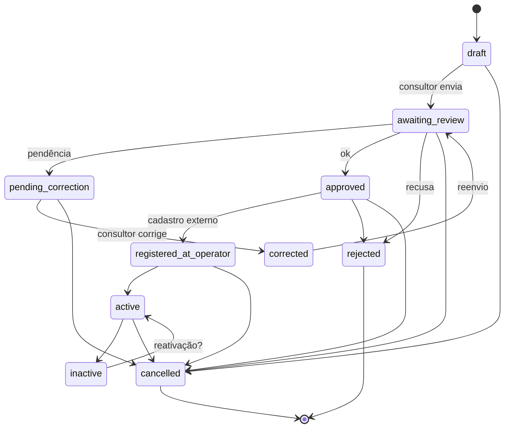

# DHub — Workflow de Contrato

**Tipo:** proposta arquitetural consolidada (Sprint 0.1). Estados ainda poderão ser ajustados após levantamento detalhado da operação. Não é regra definitiva de negócio.

Contrato = vínculo operacional lojista ↔ operadora. Status e histórico **independentes** da recarga.

## Estados candidatos (proposta principal)

`submitted` foi **removido** da proposta principal por redundância com `awaiting_review` (envio do consultor leva direto à fila de conferência).

| Estado | Significado | Responsável típico pela transição de entrada |
|--------|-------------|-----------------------------------------------|
| `draft` | Rascunho em preparação | Consultor (criar/editar); Admin; Operador |
| `awaiting_review` | Enviado e na fila de conferência do escritório | Consultor (a partir de `draft` ou `corrected`) |
| `pending_correction` | Há pendências a corrigir | Operador / Admin |
| `corrected` | Consultor sinalizou que corrigiu as pendências | Consultor |
| `approved` | Conferência aprovada internamente | Operador / Admin |
| `registered_at_operator` | Cadastrado no sistema da operadora | Operador / Admin |
| `active` | Vínculo operacional ativo | Operador / Admin |
| `rejected` | Recusado na entrada/conferência | Operador / Admin |
| `cancelled` | Cancelado | Operador / Admin; Consultor em estados iniciais — **questão aberta** (Q19) |
| `inactive` | Desativado após ter estado ativo | Operador / Admin |

### Notas sobre estados (não decisões)

| Tema | Classificação | Conteúdo |
|------|---------------|----------|
| Manter `corrected` | Proposta | Facilita distinguir “em correção” vs “já corrigido, aguardando nova conferência”. Pode ser revisto (Q15). |
| `approved` / `registered_at_operator` / `active` | Proposta | Distinguem aprovação interna, cadastro externo e operação. Sujeitos à validação operacional. |
| `rejected` / `cancelled` / `inactive` | Proposta | Semânticas distintas (recusa / desistência / desligamento). |

## Pré-condições (proposta)

| Transição | Pré-condições propostas |
|-----------|-------------------------|
| `draft` → `awaiting_review` | Lojista e operadora vinculados; campos/docs mínimos **somente quando configurados e confirmados** (Q03, Q04) |
| → `pending_correction` | Ao menos uma pendência aberta no contrato |
| → `corrected` | Pendências tratadas pelo consultor (critério exato a confirmar) |
| → `approved` | Conferência registrada; sem pendências abertas |
| → `registered_at_operator` | Contrato `approved`; cadastro externo feito (manual no MVP) |
| → `active` | Registro na operadora concluído (se a operação mantiver essa etapa) |
| → `inactive` | Contrato estava `active` |
| → `cancelled` / `rejected` | Conforme política de ator (Q19) |

## Transições válidas (proposta)

```text
draft → awaiting_review | cancelled
awaiting_review → pending_correction | approved | rejected | cancelled
pending_correction → corrected | cancelled
corrected → awaiting_review
approved → registered_at_operator | rejected | cancelled
registered_at_operator → active | cancelled
active → inactive | cancelled
inactive → active   # reativação — questão aberta Q20
rejected → (terminal ou reabertura — em aberto)
cancelled → (terminal)
```

## Transições inválidas (exemplos)

- `draft` → `active` (pula conferência)
- `pending_correction` → `active`
- `rejected` → `active` sem reabertura formal
- Qualquer estado de contrato usado como status de recarga
- Consultor: `awaiting_review` → `approved` / `rejected` / `registered_at_operator` / `active`
- Uso de `submitted` (estado removido da proposta principal)

## Efeitos (proposta)

| Evento | Efeitos |
|--------|---------|
| Qualquer transição de status | Grava `contract_status_history` (histórico operacional) |
| Alteração relevante de dados | Grava `audit_logs` (auditoria técnica) |
| → `pending_correction` | Notificação in-app ao consultor (WhatsApp depois, se integrado) |
| → `awaiting_review` (de `corrected`) | Reentra na fila de conferência |
| → `approved` / `active` | Liberação de recargas **somente se** regra de negócio confirmar (Q16) |

## Eventos de histórico operacional

Registro append-only em `contract_status_history`:

- `from_status`, `to_status`
- ator (`changed_by`)
- nota opcional
- `changed_at`

Não confundir com auditoria técnica (`audit_logs`) nem com logs de integração/segurança.

## Diagrama Mermaid



## Atores × capacidades (proposta)

| Ação | Consultor | Operador | Admin |
|------|-----------|----------|-------|
| Criar/editar `draft` | Sim (próprios) | Sim | Sim |
| Enviar → `awaiting_review` | Sim (próprios) | Condicional | Sim |
| Conferir / aprovar / rejeitar | Não | Sim | Sim |
| Abrir pendência | Não | Sim | Sim |
| Marcar `corrected` / reenviar | Sim | — | Sim |
| Registrar na operadora / ativar / inativar | Não | Sim | Sim |
| Ver histórico operacional do contrato | Sim (próprios) | Sim | Sim |
| Ver auditoria técnica | Não | Não | Sim |

Detalhes: `AUTHORIZATION_AND_RLS.md`. Dúvidas: `OPEN_QUESTIONS.md`.
