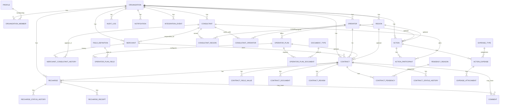

# DHub — Modelo de Domínio

Fonte de verdade: `.cursor/rules/project-context.mdc` e decisões em `DECISION_LOG.md`. Dúvidas em `OPEN_QUESTIONS.md`.

**Legenda:** decisão confirmada | proposta arquitetural | hipótese | questão aberta.

## Visão geral

Fluxo oficial:

`Consultor → Lojista → Contrato por operadora → Conferência → Recargas`

Separação obrigatória: **Contrato** (vínculo lojista↔operadora) ≠ **Recarga** (movimentação dentro de um contrato).

## Entidades

### Organização (`Organization`)

- **Descrição:** Tenant do sistema (ex.: Prime Service).
- **Responsabilidades:** Agrupar usuários, consultores, lojistas, operadoras, contratos e recargas.
- **Invariantes:** Toda entidade operacional pertence a exatamente uma organização.
- **Relacionamentos:** 1 → N com membros, consultores, lojistas, operadoras, contratos, recargas, auditoria.

### Usuário / Perfil (`User` / `Profile`)

- **Descrição:** Identidade autenticável (Supabase Auth) com perfil de aplicação.
- **Responsabilidades:** Autenticação; vínculo a organização(ões) e papel.
- **Invariantes:** Acesso sempre mediado por membership e papel; sem bypass só no frontend.
- **Relacionamentos:** N ↔ N com organizações via membership; 0..1 vínculo a consultor quando aplicável.

### Perfil / Papel (`Role`)

Valores confirmados para o MVP:

| Papel | Escopo de acesso |
|-------|------------------|
| `admin` | Configuração, operação completa, relatórios, históricos operacionais, auditoria técnica |
| `operator` | Operação (contratos/recargas/conferência/pendências) e históricos operacionais necessários; sem configs críticas; sem auditoria técnica |
| `consultant` | Somente seus lojistas, contratos, recargas e históricos autorizados do escopo; sem auditoria técnica |

Lojista não possui papel de login no MVP.

### Consultor (`Consultant`)

- **Descrição:** Representante comercial operacional (`consultants`), distinto de `organization_members`.
- **Responsabilidades:** Manter lojistas; vínculo opcional com usuário Auth (`user_id`).
- **Invariantes:** Vê apenas dados sob sua responsabilidade; não acessa dados de outro consultor.
- **Relacionamentos:** 1 → N lojistas (responsabilidade atual); 0..1 `user_id` → `profiles`.

### Lojista (`Merchant`)

- **Descrição:** Cliente final (`merchants` / UI “Lojistas”). Sem login no MVP.
- **Responsabilidades:** Titular futuro de contratos; cadastro único por organização.
- **Invariantes:** Um consultor responsável; mesma organização do consultor (FK composta); documento opcional sem unique rígido (Q17).
- **Relacionamentos:** N → 1 consultor responsável.

### Histórico de consultor (`MerchantConsultantHistory`)

- **Descrição:** Registro de mudanças do consultor responsável pelo lojista.
- **Responsabilidades:** Preservar rastreabilidade de trocas de responsabilidade.
- **Invariantes:** Alterações relevantes auditáveis; regras de troca ainda em aberto (ver `OPEN_QUESTIONS.md`).
- **Relacionamentos:** N → 1 lojista; N → 1 consultor (anterior/novo).

### Operadora (`Operator`)

- **Descrição:** Empresa de vouchers (LeCard, Pluxee, Ticket, VR, ValeCard inicialmente).
- **Responsabilidades:** Agrupar planos e configurações (campos, documentos, prazos, pendências).
- **Invariantes:** Sem tabela física separada por operadora; diferenças via configuração.
- **Relacionamentos:** 1 → N planos; 1 → N contratos.

### Plano (`OperatorPlan`)

- **Descrição:** Configuração comercial/operacional associada a uma operadora.
- **Responsabilidades:** Agrupar campos, documentos e regras configuráveis aplicáveis a contratos.
- **Invariantes:** Regras não fixas no código; relação exata plano↔contrato em aberto.
- **Relacionamentos:** N → 1 operadora; 1 → N campos/documentos configurados; contratos podem referenciar plano.

### Definição de campo (`FieldDefinition`)

- **Descrição:** Metadado de campo dinâmico (label, tipo, validação).
- **Responsabilidades:** Permitir campos configuráveis sem schema rígido por operadora.
- **Invariantes:** Obrigatórios por operadora/plano não inventados — ver dúvidas abertas.
- **Relacionamentos:** Vinculada a planos via `operator_plan_fields`; valores em `contract_field_values`.

### Tipo de documento (`DocumentType`)

- **Descrição:** Catálogo de tipos documentais exigíveis/anexáveis.
- **Responsabilidades:** Configurar documentos por plano/operadora.
- **Invariantes:** Lista obrigatória por operadora ainda não confirmada.
- **Relacionamentos:** Vinculado a planos; instâncias em documentos do contrato / comprovantes.

### Contrato (`Contract`)

- **Descrição:** Vínculo operacional entre um lojista e uma operadora.
- **Responsabilidades:** Concentrar campos, documentos, conferências, pendências e histórico próprios.
- **Invariantes:** Pertence a um lojista e a uma operadora; separado de recarga; status e histórico próprios. Unicidade por lojista+operadora **não** é decisão confirmada (Q01).
- **Relacionamentos:** N → 1 lojista; N → 1 operadora; 0..1 plano; 1 → N documentos, valores, conferências, pendências, históricos, recargas.

### Valor de campo do contrato (`ContractFieldValue`)

- **Descrição:** Valor preenchido de um campo definido para um contrato.
- **Responsabilidades:** Persistir dados dinâmicos do contrato.
- **Invariantes:** Referencia definição existente; escopo do contrato.

### Documento do contrato (`ContractDocument`)

- **Descrição:** Arquivo/metadado documental anexado ao contrato.
- **Responsabilidades:** Suportar envio pelo consultor e conferência pelo escritório.
- **Invariantes:** Pertence ao contrato; armazenamento privado (estratégia em segurança).

### Conferência (`ContractReview`)

- **Descrição:** Ato de revisão do contrato pelo escritório.
- **Responsabilidades:** Registrar resultado da conferência e alimentar pendências/status.
- **Invariantes:** Histórico preservado; não misturar com estados de recarga.

### Pendência (`ContractPendency`)

- **Descrição:** Item a corrigir no contrato (motivo configurável).
- **Responsabilidades:** Orientar correção pelo consultor; acompanhamento pelo escritório.
- **Invariantes:** Motivos via catálogo configurável; ligada ao contrato (não à recarga, salvo decisão futura).

### Histórico do contrato (`ContractStatusHistory`)

- **Descrição:** Histórico **operacional** de mudanças de status do contrato.
- **Responsabilidades:** Rastreio do ciclo operacional (não substitui auditoria técnica).
- **Invariantes:** Imutável após gravação (append-only). Acesso: admin/operador (org); consultor (próprio escopo).

### Recarga (`Recharge`)

- **Descrição:** Movimentação realizada dentro de um contrato.
- **Responsabilidades:** Solicitar, processar, pendenciar e concluir recargas; anexar comprovantes.
- **Invariantes:** Sempre pertence a um contrato; status/histórico/regras separados do contrato.
- **Relacionamentos:** N → 1 contrato; 1 → N históricos e comprovantes.

### Histórico da recarga (`RechargeStatusHistory`)

- **Descrição:** Histórico **operacional** de status da recarga.
- **Invariantes:** Append-only; separado do histórico de contrato e de `audit_logs`.

### Comprovante (`RechargeReceipt`)

- **Descrição:** Evidência/anexo da recarga.
- **Responsabilidades:** Registro e download autorizado conforme perfil.
- **Invariantes:** Formato e regras de obrigatoriedade em aberto.

### Comentário (`Comment`)

- **Descrição:** Anotação operacional vinculada a contrato e/ou recarga (polimórfica ou tipada).
- **Responsabilidades:** Comunicação assíncrona entre consultor e escritório no contexto da entidade.

### Notificação (`Notification`)

- **Descrição:** Aviso in-app (e, depois, canais externos) sobre eventos relevantes.
- **Responsabilidades:** Informar mudanças de status, pendências e prazos.
- **Invariantes:** Canais WhatsApp/Suri fora do núcleo interno inicial.

### Auditoria (`AuditLog`)

- **Descrição:** Auditoria **técnica** (quem, o quê, quando, antes/depois).
- **Responsabilidades:** Conformidade e investigação; distinta de histórico operacional e de logs de integração/segurança.
- **Invariantes:** Toda alteração relevante gera auditoria; leitura apenas admin da org; escrita via sistema; sem exposição indevida de PII.

### Evento de integração (`IntegrationEvent`)

- **Descrição:** Fila/registro de eventos para Dropbox, n8n, Suri, WhatsApp etc.
- **Responsabilidades:** Idempotência, retries e rastreio de falhas.
- **Invariantes:** Integrações após fluxo interno estável.

### Motivo de pendência (`PendencyReason`)

- **Descrição:** Catálogo configurável de motivos.
- **Responsabilidades:** Padronizar pendências sem hard-code.

### Região (`Region`) — proposta

- **Descrição:** Catálogo configurável de regiões/cidades da organização (Q25).
- **Relacionamentos:** N ↔ N com consultores (`consultant_regions`, D34); contratos podem referenciar região (Q26).

### Consultor ↔ Bandeira (`ConsultantOperator`) — proposta

- **Descrição:** Bandeiras (operadoras) que o consultor atende (D35).
- **Invariantes:** Sem tabela por bandeira; vínculo com status.

### Navegação de documentos por pastas — proposta

- Região → Consultor → Bandeira → Mês (D36), **derivada** de `contract_documents` + `contracts` + `merchants` + `consultants`; não há entidade "pasta".
- `contract_documents.reference_month` define o mês (critério em Q21).

### Ação (`Action`) — proposta

- **Descrição:** Ação de bandeira que pode exigir viagem de consultores (D37).
- **Responsabilidades:** Agrupar participantes, período, região, orçamento e despesas.
- **Invariantes:** Gerida somente por admin (D38); cancelamento em vez de exclusão.
- **Relacionamentos:** 0..1 bandeira; 0..1 região; N ↔ N consultores (`action_participants`); 1 → N despesas.

### Despesa da ação (`ActionExpense`) — proposta

- **Descrição:** Gasto ligado à ação (passagem aérea, aluguel de carro, combustível, recarga de cartão combustível/corporativo, contas etc.).
- **Responsabilidades:** Valor previsto × realizado, fornecedor, forma de pagamento, status, comprovantes.
- **Invariantes:** Tipo vem de catálogo configurável (`expense_types`); comprovantes em storage privado.
- **Relacionamentos:** N → 1 ação; N → 1 tipo; 0..1 consultor beneficiado; 1 → N comprovantes.

## Relacionamentos e cardinalidades

| De | Para | Cardinalidade | Notas |
|----|------|---------------|-------|
| Organization | Members / Profiles | 1:N | Membership |
| Organization | Consultants, Merchants, Operators, Contracts, Recharges | 1:N | Multi-tenant |
| Consultant | Merchants | 1:N | Responsável atual |
| Merchant | Consultant history | 1:N | Histórico |
| Merchant | Contracts | 1:N | Vários contratos |
| Operator | Plans | 1:N | Configuração |
| Operator | Contracts | 1:N | |
| Plan | Field/Document configs | 1:N | |
| Contract | Field values, Documents, Reviews, Pendencies, History | 1:N | |
| Contract | Recharges | 1:N | |
| Recharge | History, Receipts | 1:N | |
| Consultant | Regions | N:N | `consultant_regions` (proposta) |
| Consultant | Operators | N:N | `consultant_operators` (proposta) |
| Action | Consultants | N:N | `action_participants` (proposta) |
| Action | Expenses | 1:N | Proposta |
| Expense | Attachments | 1:N | Proposta |

## Diagrama Mermaid

## Notas

- Campos obrigatórios, documentos, prazos e regras de unicidade de contrato: ver `OPEN_QUESTIONS.md` (Q01–Q06).
- Não modelar uma tabela/módulo por planilha ou por operadora.
- Estados de contrato/recarga: propostas em `CONTRACT_WORKFLOW.md` / `RECHARGE_WORKFLOW.md` (sem `submitted`).
