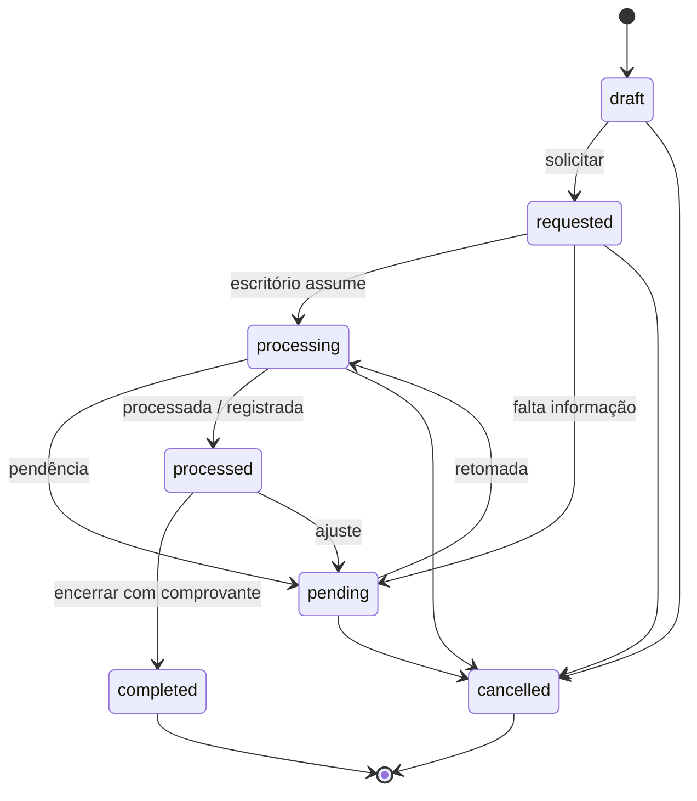

# DHub — Workflow de Recarga

**Tipo:** proposta arquitetural consolidada (Sprint 0.1). Sujeita à validação operacional. Não é regra definitiva de negócio.

Recarga ≠ contrato: status, histórico, comprovantes e regras próprios. Recarga = movimentação dentro de um **contrato** existente.

## Estados candidatos

| Estado | Significado | Responsável típico pela transição de entrada |
|--------|-------------|-----------------------------------------------|
| `draft` | Rascunho da solicitação | Consultor / Operador / Admin |
| `requested` | Solicitação formalizada ao escritório | Consultor |
| `processing` | Em tratamento pelo escritório | Operador / Admin |
| `pending` | Aguardando retorno, correção ou informação | Operador / Admin (abre); Consultor pode complementar |
| `processed` | A operação foi processada pelo escritório ou registrada na operadora | Operador / Admin |
| `completed` | O ciclo administrativo foi finalizado, incluindo comprovante e encerramento | Operador / Admin |
| `cancelled` | Cancelada | Operador / Admin; Consultor em estados iniciais — **questão aberta** (Q19) |

## Diferença entre `processed` e `completed`

**Proposta inicial consolidada** (Sprint 0.1), sujeita à validação operacional:

| Estado | Definição consolidada |
|--------|------------------------|
| `processed` | A operação foi processada pelo escritório ou registrada na operadora. Ainda pode faltar comprovante, conferência final ou encerramento administrativo. |
| `completed` | O ciclo administrativo foi finalizado, incluindo comprovante (quando aplicável) e encerramento. |

Obrigatoriedade de comprovante para `completed`: **questão aberta** (Q10). Fluxo real atual: **questão aberta** (Q07). Se a operação não distinguir as etapas, unificar e registrar em `DECISION_LOG.md`.

## Pré-condições (proposta)

| Transição | Pré-condições propostas |
|-----------|-------------------------|
| Criar recarga | Contrato acessível; status do contrato permitido — **em aberto** (Q16) |
| → `requested` | Dados mínimos da solicitação (campos a confirmar) |
| → `processed` | Tratamento operacional / registro na operadora concluído |
| → `completed` | Estado `processed` + comprovante e encerramento conforme regras que forem confirmadas |

## Transições válidas (proposta)

```text
draft → requested | cancelled
requested → processing | cancelled | pending
processing → pending | processed | cancelled
pending → processing | cancelled
processed → completed | pending
completed → (terminal)
cancelled → (terminal)
```

## Transições inválidas (exemplos)

- Recarga em contrato inexistente ou de outra organização
- `draft` → `completed`
- Consultor: `requested` → `processed` / `completed`
- Usar status de contrato como status de recarga

## Efeitos (proposta)

| Evento | Efeitos |
|--------|---------|
| Qualquer transição de status | Grava `recharge_status_history` (histórico operacional) |
| Alteração relevante | Grava `audit_logs` (auditoria técnica) |
| → `pending` | Notificar consultor/responsável no escopo |
| → `completed` | Ciclo encerrado; comprovante disponível para download autorizado |

## Comprovante

- Entidade `recharge_receipts` ligada à recarga.
- Upload típico: operador/admin; download: consultor quando autorizado.
- Formato e obrigatoriedade: `OPEN_QUESTIONS.md` (Q10).
- Bloqueio de `completed` sem comprovante: **hipótese** até confirmação.

## Histórico operacional

`recharge_status_history` append-only, separado de `contract_status_history`.

Não confundir com:

- auditoria técnica (`audit_logs`);
- logs de integração (`integration_events`);
- logs de segurança.

## Diagrama Mermaid



## Atores × capacidades (proposta)

| Ação | Consultor | Operador | Admin |
|------|-----------|----------|-------|
| Criar draft / solicitar | Sim (escopo) | Sim | Sim |
| Processar → `processed` | Não | Sim | Sim |
| Abrir pendência de recarga | Não | Sim | Sim |
| Anexar comprovante | Limitado / autorizado | Sim | Sim |
| Completar (`completed`) | Não | Sim | Sim |
| Ver histórico operacional | Sim (próprios) | Sim | Sim |
| Ver auditoria técnica | Não | Não | Sim |

Ver `AUTHORIZATION_AND_RLS.md` e `OPEN_QUESTIONS.md`.
